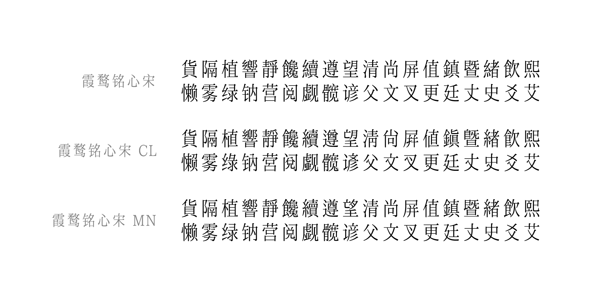

# 霞鹜铭心宋 / LXGW Heart Serif
基于[「こころ明朝体」](https://typingart.net/?p=46)以及[「霞鹜新致宋」](https://github.com/lxgw/LxgwNeoZhiSong)[「霞鹜致宋 CL/MN」](https://github.com/lxgw/LxgwZhiSong)衍生的中文黑体字型。

将字面横向压缩 85%，并增加圆角，更加清瘦、圆润。
## 概览

## 不同字形版本及收字情况
- **霞鹜铭心宋：** 采用中国大陆规范字形（GB 字形）。收录的汉字部分与 [霞鹜新致宋 v0.924](https://github.com/lxgw/LxgwNeoZhiSong/releases/tag/v0.924) 看齐。
- **霞鹜铭心宋 CL：** 参考早期铅字印刷字形常见写法，回归旧式印刷字形，合并一部分「源规格分离」原则下分化的异码字。收录的汉字部分与 [霞鹜致宋 CL v0.321](https://github.com/lxgw/LxgwZhiSong/releases/tag/v0.321) 看齐。
- **霞鹜铭心宋 MN：** 采用兼顾当代惯用部件写法的折中印刷字形（非楷化字形），严格遵循「源规格分离」原则。收录的汉字部分与 [霞鹜致宋 MN v0.321](https://github.com/lxgw/LxgwZhiSong/releases/tag/v0.321) 看齐。
- 铭心宋所收的符号相比于新致宋会有所欠缺。

## 获取字体
进入 [Releases](https://github.com/lxgw/LxgwHeartSerif/releases) 页面下载 TTF 格式字体文件。Release 版本号与 GB 字形的「霞鹜铭心宋」相同。
## 授权信息
- 本字体在 IPA 所开发并发布的 [IPAex明朝](https://moji.or.jp/ipafont)、[「こころ明朝体」](https://typingart.net/?p=46) 基础上衍生，依照 [IPA开放字型授权条款 第1.0版（IPA Font License 1.0）](https://opensource.org/licenses/IPA/) 授权。
- 但凡有任何人使用、复制、修改、分发本字体，或对本字型进行任何符合 IPA Font License 1.0 规定的行为，使用、下载或行使合约规定权利之接受方，亦视为同意遵守 IPA Font License 1.0 的一切规定。
- 根据 IPA Font License 1.0 有关条款，后续衍生不可使用原始授权程序的名称（包括程序名、文件名、字体名），且须继承原有授权条款（故 IPA Font License 1.0 与 SIL OFL 1.1 不兼容）。
- 有关 IPA Font License 1.0 的其他常见问题，请参阅 [FAQ（日语）](https://moji.or.jp/ipafont/faq/)，需自备翻译工具。
- 「IPA字体（IPA Font，IPAフォント）」为日本「独立行政法人情报处理推进机构」（简称「IPA」）的注册商标。
## 更多「霞鹜」系列字型
### 与本项目有关联的字型
- [霞鹜新晰黑 / LXGW Neo XiHei](https://github.com/lxgw/LxgwNeoXiHei)
- [霞鹜新致宋 / LXGW Neo ZhiSong](https://github.com/lxgw/LxgwNeoZhiSong)
- [霞鹜晰黑 / LXGW XiHei](https://github.com/lxgw/LxgwXiHei)
- [霞鹜致宋 / LXGW ZhiSong](https://github.com/lxgw/LxgwZhiSong)
### 「霞鹜文楷」系列
- [霞鹜文楷 / LXGW WenKai](https://github.com/lxgw/LxgwWenKai) | [Lite](https://github.com/lxgw/LxgwWenKai-Lite)
- [霞鹜文楷 GB / LXGW WenKai GB](https://github.com/lxgw/LxgwWenKaiGB) | [Lite](https://github.com/lxgw/LxgwWenKaiGB-Lite)
- [霞鹜文楷 TC / LXGW WenKai TC](https://github.com/lxgw/LxgwWenKaiTC)
### 其他
- [霞鹜漫黑 / LXGW Marker Gothic](https://github.com/lxgw/LxgwMarkerGothic)
- [小赖字体 / Xiaolai](https://github.com/lxgw/kose-font)
- [悠哉字体 / Yozai](https://github.com/lxgw/yozai-font)
